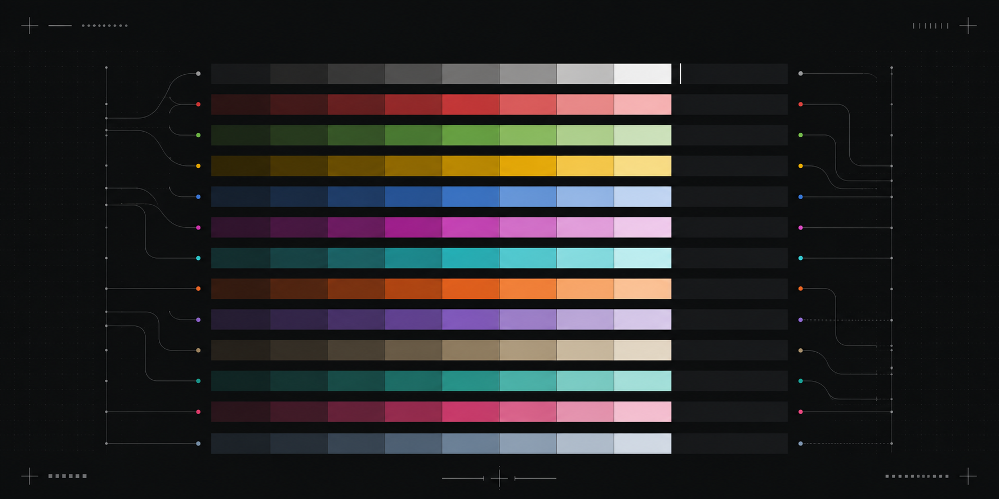

<p align="center">
  
</p>

# Terminal Theme Picker

A native macOS color browser for Apple Terminal. Search a large catalog, inspect the full ANSI palette and syntax sample, then apply the theme to the Terminal tab you use now.

It is built for the moment when a theme name is not enough information.

## What it does

- Shows 606 Apple Terminal-compatible themes from the iTerm2-Color-Schemes catalog.
- Shows all 16 ANSI colors, background, text, and a six-line syntax preview.
- Uses white text on dark previews and black text on light previews for labels and guidance.
- Applies the selected profile to one Terminal tab. It does not change the default profile.
- Opens with `Option-Shift-P`, even when a terminal application owns the input.

## Install

You need macOS, Apple Terminal, Python 3, and [fzf](https://github.com/junegunn/fzf).

```sh
git clone --recurse-submodules https://github.com/0-CYBERDYNE-SYSTEMS-0/terminal-theme-picker.git
cd terminal-theme-picker
python3 -m pip install -r requirements.txt
python3 install.py
```

The installer creates a per-user LaunchAgent. The small palette icon in the menu bar also opens the picker.

## Use the native picker

1. Select the Apple Terminal tab that you want to change.
2. Press `Option-Shift-P`.
3. Search, select a theme, and select **Apply Theme**.

The target application can keep running. The picker changes its Terminal tab without sending text to that application.

The first use of a theme imports its Apple Terminal profile. Apple Terminal can open one background window during that import. Later uses apply the saved profile directly.

## Use the shell picker

Run this from the Apple Terminal tab that you want to change:

```sh
./theme-picker
```

The shell picker uses `fzf`. It gives each theme a swatch strip and a large live preview.

## Theme catalog

This project includes [iTerm2-Color-Schemes](https://github.com/mbadolato/iTerm2-Color-Schemes) as a Git submodule. That project is MIT licensed. Individual themes can have their own authors and licenses. See its [license](vendor/iTerm2-Color-Schemes/LICENSE) and the theme metadata before redistribution.

## License

The picker code and the graphic are [MIT licensed](LICENSE). The theme catalog keeps its own license and attribution.
